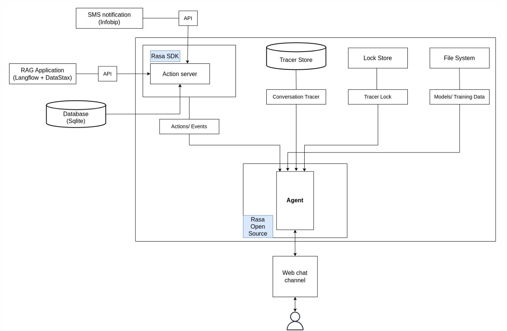

# 🏥 Healthcare Appointment Chatbot

## 📌 Project Overview

This project introduces an intelligent **Healthcare Chatbot** designed to **automate customer service for clinics**, enabling 24/7 support, reducing staff workload, and enhancing user experience. The chatbot provides **fast, accurate, and context-aware responses** to patients, streamlines **appointment management**, and delivers **automated SMS notifications**.

## 🎯 Key Features

- **Book/Search/Cancel Appointments** via chatbot interface  
- **Answer Questions** about clinic services, working hours, and doctors  
- **Send SMS Notifications** for appointment confirmations and updates  
- **Store and manage data** in a backend database  
- **Simple web interface** for interaction  

## 🧠 Technologies Used

| Component            | Technology                           |
|----------------------|---------------------------------------|
| Core Chatbot Engine  | Rasa Open Source, Langflow |
| Interface            | HTML/CSS (web UI)                    |
| Notifications        | SMS API Integration                  |
| Backend              | SQLite (data storage)   |
| Deployment           | Dockerized (Localhost) |

## 🛠 System Architecture

- **Rasa Agent**: Handles intent recognition, dialogue management, and entity extraction.  
- **RAG Module**: Retrieves answers from clinic documents for better contextual responses.  
- **Database**: Stores appointment info and conversation history.  
- **SMS Module**: Sends reminders and booking confirmations to patients.

## 📽️ Demo
🎬 Click the image below to watch the demo video on YouTube:

[](https://youtu.be/7Wv-AgU5ET8)

## 🚀 Future Development

- 🔍 Detect and handle **overlapping appointments** or out-of-hours bookings  
- 🧑‍⚕️ Suggest **specialists** based on symptoms or conditions  
- 🧩 Integrate with **Electronic Health Records (EHR)** and medical recommendation systems

## 💡 Motivation

Healthcare providers often face overwhelming workloads and limited human resources. By leveraging **AI-powered conversational agents**, this project contributes to smarter, faster, and more accessible healthcare services.

### 📄 View Full Report

For more detailed information about system design, technology selection, and implementation, please refer to the full project report:
👉 [📘 Final Project Report (PDF)](Final_project_report.pdf)


## 🚀 How to Run the Project
### 📥 Clone the Repository
    git clone https://github.com/dduyds/Healthcare-Appointment-Chatbot.git
    cd Healthcare-Appointment-Chatbot/Source

### 🔧 Run Without Docker
1. **Install Python dependencies**
   ```bash
   pip install -r requirements.txt
2. **Start Rasa Server**
   ```bash
   rasa run --cors "*"
3. **Start Action Server**
   ```bash
   rasa run actions
4. **Chat with the bot**
   ```bash
   http://localhost:8000/index.html
###  🐳 Run With Docker
1. **Build Docker image**
   ```bash
   docker build -t rasa-chatbot .
2. **Run Docker container**
   ```bash
   docker run -p 5005:5005 -p 5055:5055 -p 8000:8000 rasa-chatbot
3. **Chat with the bot**
   ```bash
   http://localhost:8000/index.html
